# ✈️ Flight Delays Analysis (R Programming Project)

## 📌 Project Overview
This project analyzes flight delays using **R programming**.  
The dataset includes flight information such as scheduled time, departure time, carrier, weather, and delay status.  
The goal was to visualize the impact of different factors on delays using **histograms, scatter plots, box plots, bar charts, and pie charts**.

---

## 🛠️ Tools & Packages
- R Programming  
- ggplot2  
- dplyr  
- readxl  
- tidyverse  
- lubridate  

---

## 📂 Repository Contents
- `datasets/Flight_Delays.xlsx` → Dataset  
- `FlightDelays.R` → R Script with analysis code  
- `images/` → All chart images  
- `Flight_Delay_Project_Summary.pdf` → Project Report  
- `My_Learning_Experience.pdf` → Learning Note  
- `README.md` → Documentation  

---

## 📊 Visualizations (in analysis order)

### 1) Scheduled Time Distribution  
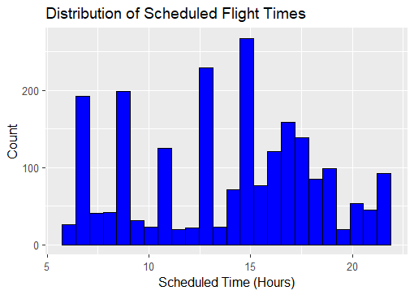

### 2) Flights per Carrier  
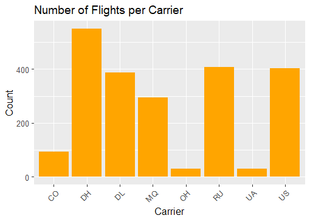

### 3) Flight Distribution by Destination  
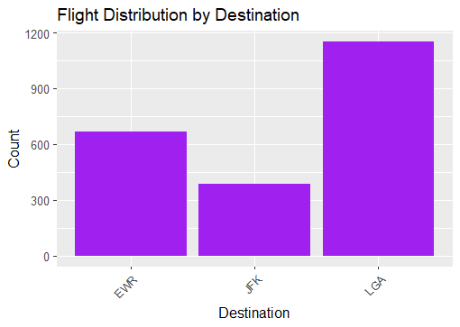

### 4) Flight Distribution by Origin  
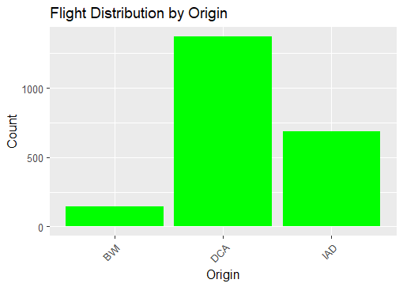

### 5) Flights Distribution by Weather Condition  
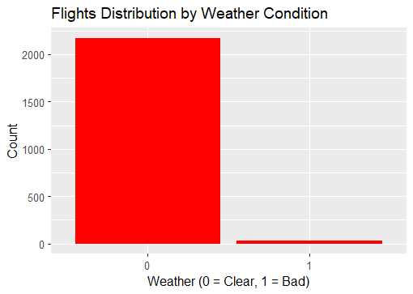

### 6) Flights Distribution by Day of the Week  


### 7) Scheduled vs Departure Time (Scatter Plot)  
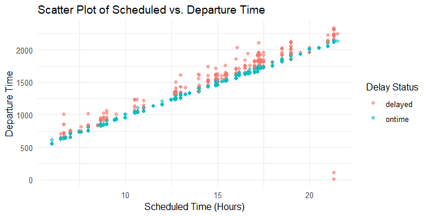

### 8) Delay Distribution by Day of the Month (Box Plot)  
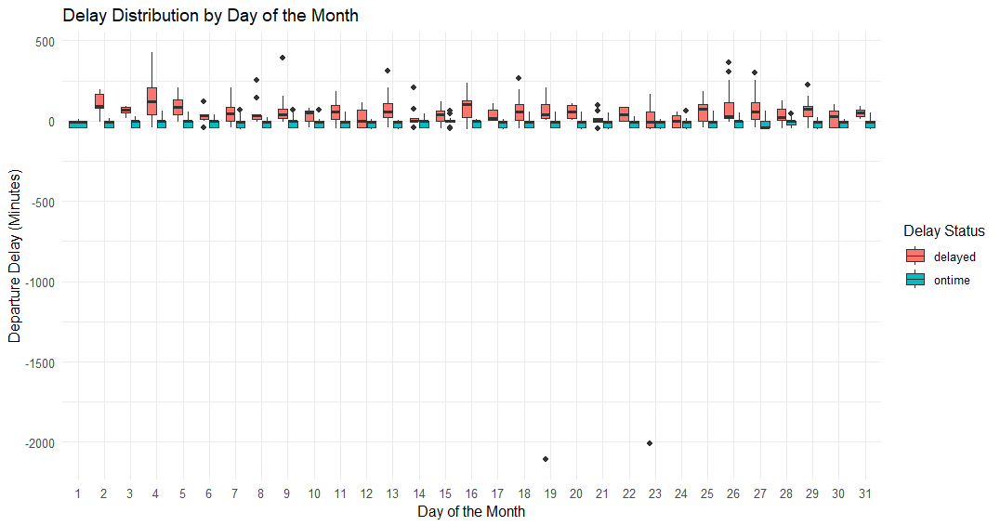

### 9) Flight Delays by Departure Period  
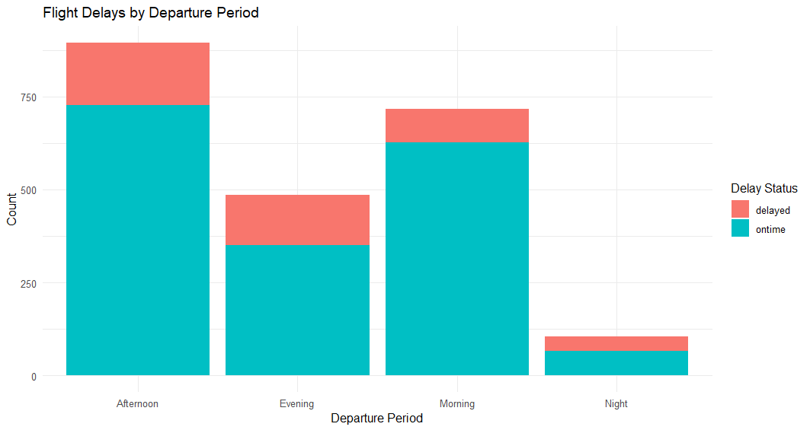

### 10) Flight Delays by Carrier  
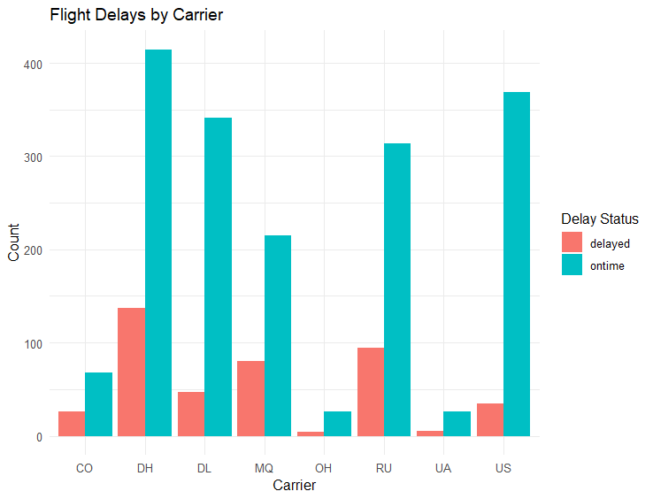

### 11) Flight Delays by Day of the Week  
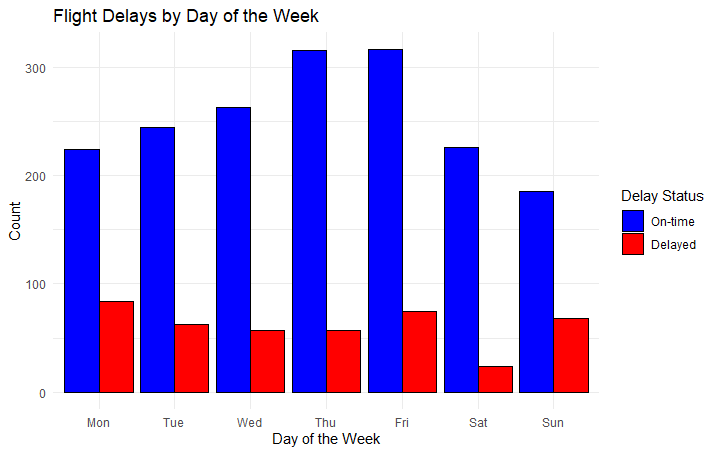

### 12) Flight Delays by Weather  
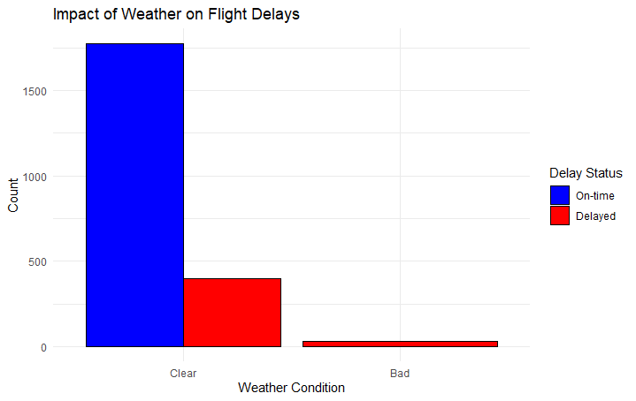

### 13) Flight Delays by Scheduled Time  
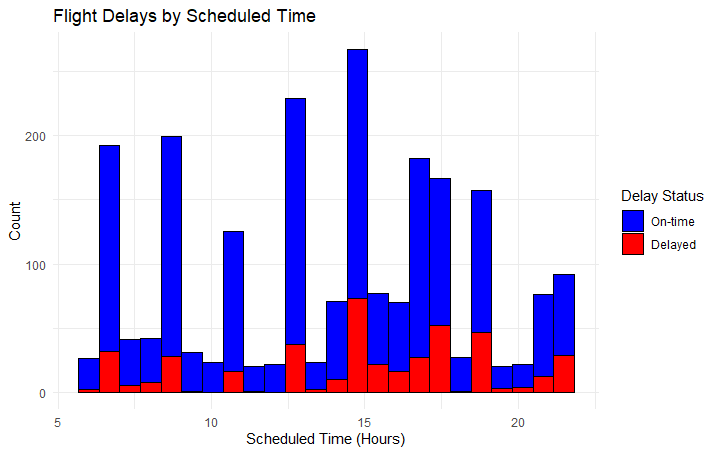

### 14) Delayed vs On-Time Flights (Pie Chart)  
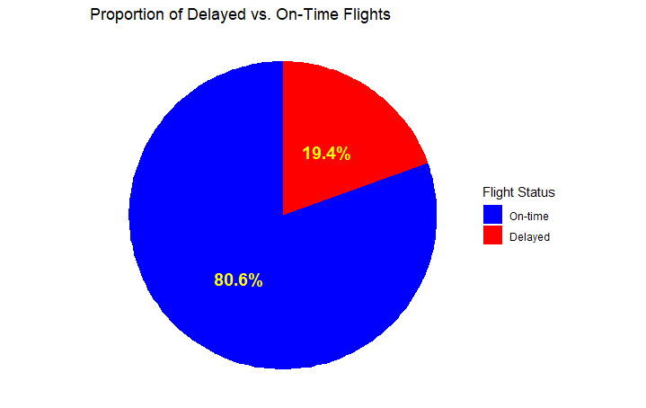

---

## 🔑 Key Insights
- **19.45% of flights were delayed**, 80.55% were on-time.  
- Delays were **more frequent in late evening flights**.  
- Certain airlines had **higher delay rates** than others.  
- **Weather caused only 1.5% of delays**, but when bad weather occurred, delays were almost certain.  

---

## 🧑‍💻 Learning Experience
Working on this project gave me a valuable opportunity to apply R programming concepts to a real dataset.  
I learned data cleaning, time conversion, categorical representation, and visualization using **ggplot2** and **dplyr**.  
This project strengthened my ability to explore and present insights clearly.

---

## ▶️ How to Run
1. Download this repository.  
2. Install required R packages:  
   ```R
   install.packages(c("ggplot2","dplyr","readxl","lubridate","tidyverse"))
3. Run the script:
   source("FlightDelays.R")
